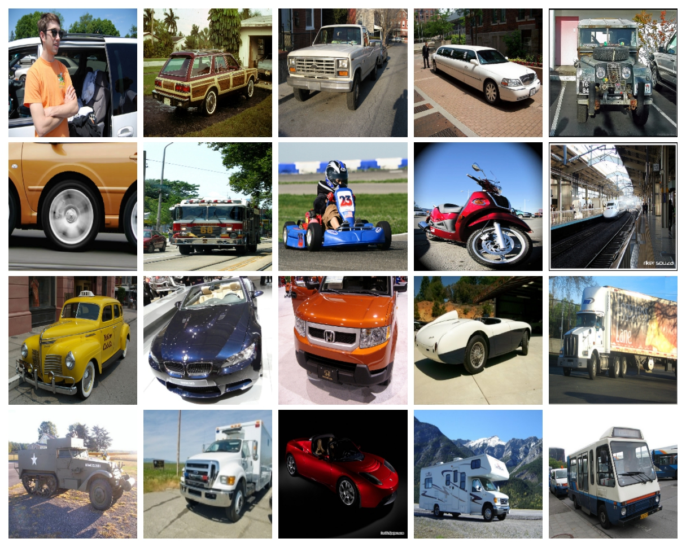

# BloomCoreset
Official implementation of the work BloomSSL: Fast Fine-Grained Self-Supervised Learning using Bloom Filters

## Fine-Grained SSL Framework

 
 

## Sampled Coresets from ImageNet1k Open-Set using BloomSSL

| Classes  | Top-20 | Frequency Plot |
|---|---|---|
| Cars  |   |  |
| Cubs  |   |  |
| Dogs  |   |  |
| Texture (dtd)  |   |  |
| Indoor (mit67)  |   |  |
| Pets  |   |  |
| Action (stanford40)  |   |  |

## Results

 

## References
1. Code is heavily based on OpenSSL-SimCore [[link](https://github.com/sungnyun/openssl-simcore)]; we thank the authors for making the code publicly available.
