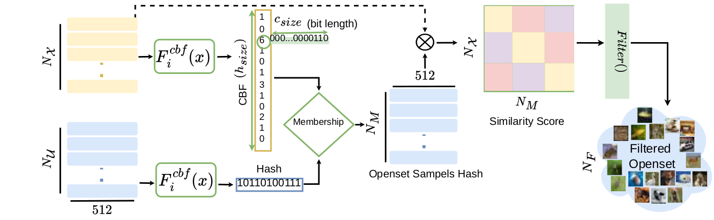

# BloomCoreset

Deep learning success in supervised fine-grained recognition for domain-specific tasks relies heavily on expert annotations. The Open-Set for fine-grained Self-Supervised Learning problem aims to improve the performance of downstream tasks by sampling similar images (Coreset) to target datasets from large-scale unlabeled datasets (Open-Set). In this paper, we propose a novel BloomCoreset method to significantly reduce sampling time from Open-Set while preserving the quality of samples in coreset. We utilize Bloom filter as an innovative hashing mechanism to store both low and high-level features of the fine-grained dataset, as captured by Open-CLIP, in a space-efficient manner to facilitate the fast retrieval of coreset from open-set. To show the effectiveness of the sampled coreset, we integrate the proposed method into a state-of-the-art (SOTA) fine-grained SSL framework, SimCore. The proposed algorithm drastically outperforms the sampling strategy of baseline with a 98.5% reduction in sampling time with a mere 0.83% average trade-off in accuracy calculated across 11 downstream datasets.

## Fine-Grained SSL Framework

 
 

## Sampled Coresets from ImageNet1k Open-Set using BloomCoreset

| Classes  | Top-20 | Frequency Plot |
|---|---|---|
| Cars  |   |  |
| Cubs  |   |  |
| Dogs  |   |  |
| Texture (dtd)  |   |  |
| Indoor (mit67)  |   |  |
| Pets  |   |  |
| Action (stanford40)  |   |  |

## Results

 

## References
1. Code is heavily based on OpenSSL-SimCore [[link](https://github.com/sungnyun/openssl-simcore)]; we thank the authors for making the code publicly available.
